# Visual Recognition Workshop

## Lab 2 : Creating custom classifier with UI

### Objectives : Teaching Watson New Tricks

The Visual Recognition service is trained by providing example images for each classification bucket -- the more examples you provide, the better the accuracy. After Watson has trained itself on your images,
then it will classify a new image that it has never seen before and calculate how confident it is that it belongs to one of your classification types.

1. Once again click the **watson\_vision\_combined-dsx** service link to return to the main page of this service.
2. Click on the **Launch Tool** button to open the Visual Recognition service and get an overview of the available pre-trained models.
3. Click **Create Model** on the **Custom** tile.

    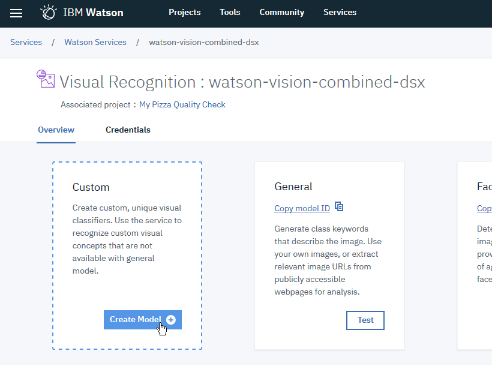

4. Rename your model by clicking on the pencil near **Default Custom Model**

    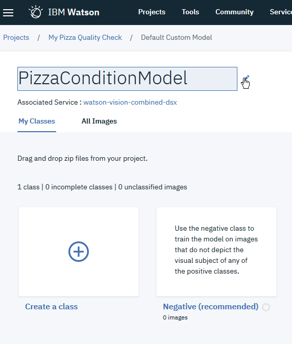

5. You will now load images create your model classes. The pane to manage file upload is shown on the right side of your screen and is displayed clicking the **Find and add images** button on the toolbar. 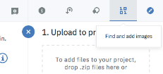

Click the **Browse** button to upload a zip file containing at least 10 photos (.jpg or .png) for good pizzas, at least 10 photos for bad pizzas, and 10 photos for not-pizzas. You can also drag and drop from your file explorer **good\_pizza\_images.zip**, **bad\_pizza\_images.zip**  and **not_pizza_images.zip** in the `Lab 2 - Training Set`  folder.

  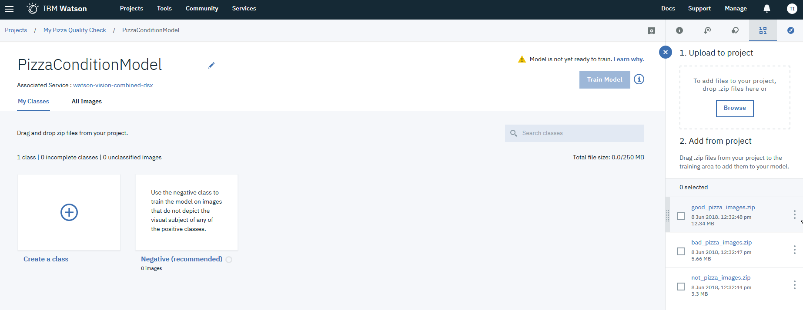

6. Create 2 classes by clicking on the + sign : **GoodConditionPizza** and **BadConditionPizza**

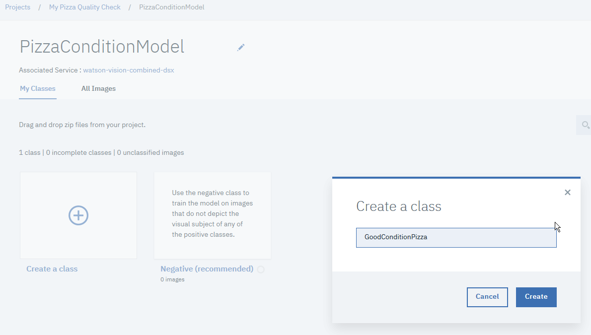

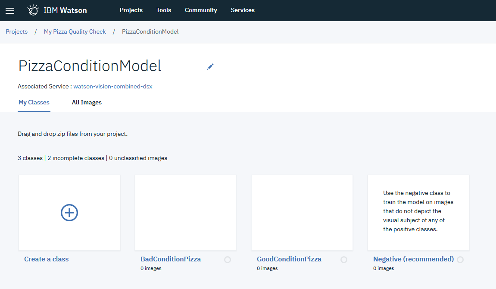

7. Then drag the "**good_pizza_images.zip**" data set from the right of the screen to the **GoodConditionPizza** class card. Upon completion you will see image thumbnails for the class displayed in the tile.

    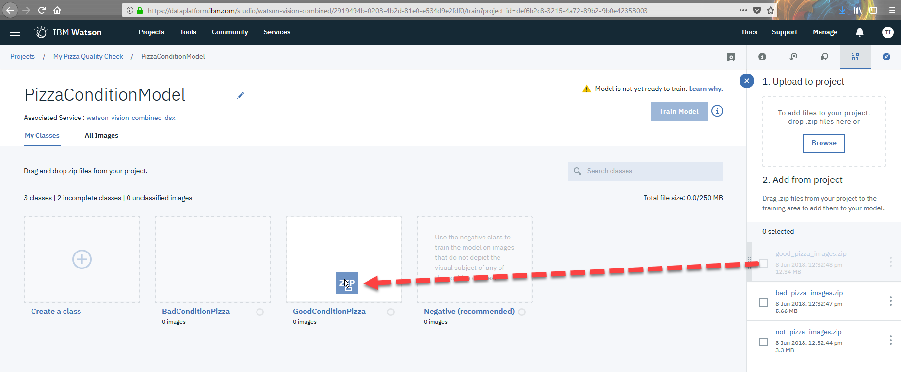

8. Then drag and drop the "**bad_pizza_images.zip**" data set to the **BadConditionPizza** class card

    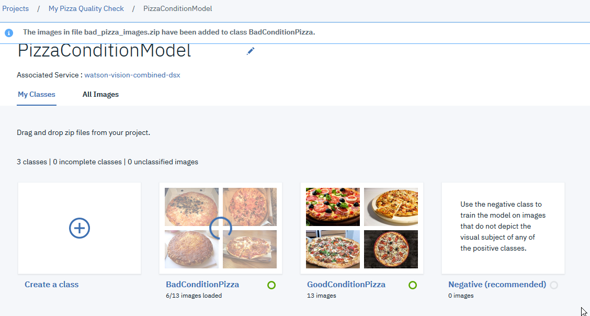

9. Drop the  **"not\_pizza\_images.zip"** data set  classifier to the **Negative (recommended)** card to specify images which are not from the defined classes.

   

10. You can now have Watson train on your custom images by clicking the **Train Model** button. Watson will take a few minutes to train on your custom images. Even though it might seem like Watson is taking
     a long time, Watson set a world record for the fastest training of 7.5 million images in 7 hours versus the previous record taking 10 days (i.e. 34 times faster):
     <http://fortune.com/2017/08/08/ibm-deep-learning-breakthrough/>

This is really powerful! You can train Watson si it recognizes what you want, even if the most obvious object in a picture isn't what you want. Let's say you are in the tire business; most image recognition software
(Watson included) will recognize an automobile image instead of the tires that you care about. Building your custom model will allow you to create a domain specific image recognition service.

Here's another example of a customer using IBM Watson Visual Recognition to detect cell phone tower panels that are in need of repair: <https://www.youtube.com/watch?v=BWDfP_udMA0> Most image
recognition services might tell you it is a cell tower, but they won't tell you which ones need repair -- this is the power of customized training just for your needs.

### Test the classifier

Now that Watson has been trained on your specific images, let's test it out using the toolkit.

1. Click the **watson\_vision\_combined-dsx** link to return to the Visual Recognition service and scroll down until you see your newly trained **PizzaConditionModel** model.

    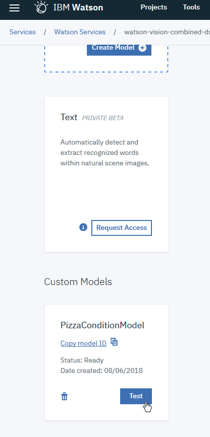

2. Click the **Test** button, which will take you to your Overview tab showing you information about this model.

    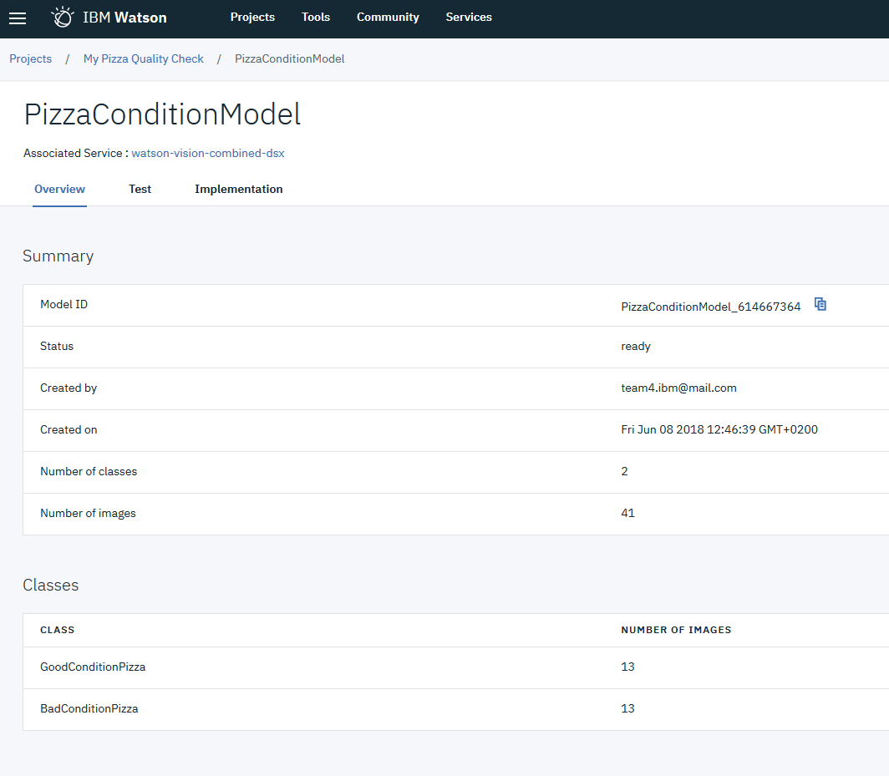

3. Click the **Test** tab and drop some pizza images onto the canvas to see how your custom model performs. **Tip:** you'll find a folder named `Lab 2 - Test images` in the Box folder
    that contains some test images you can use; or find some from your favorite search engine.

    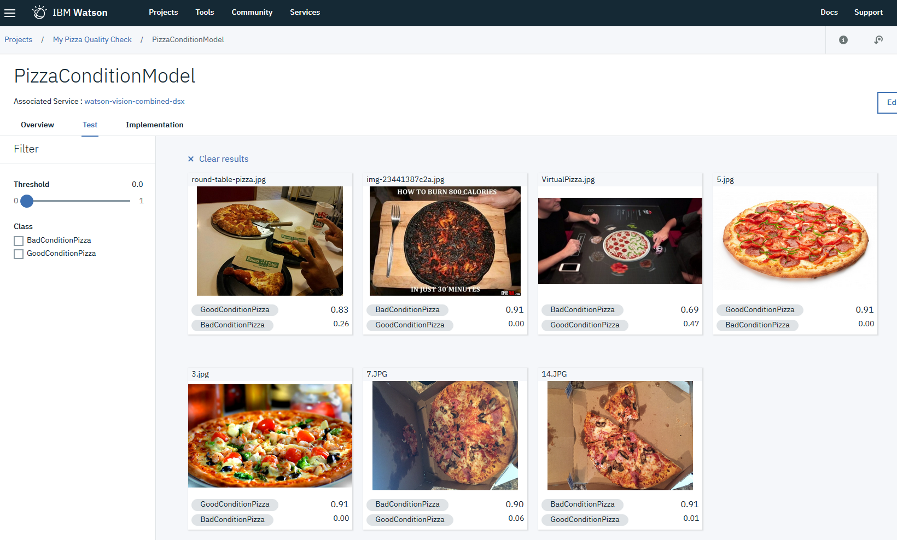

There you have it! You have trained Watson to "recognize" pizzas that have been damaged and drive customer dissatisfaction. With this knowledge, you can now determine if there is a pattern to the damaged pizzas and thus take decisions to resolve the issue and improve customer satisfaction.

### Improve the classifier

If needed you can improve the model by adding new classes or updating existing classes.

To retrain an existing model, you need to create a zip file containing new images to be added to existing classes, to a new class, or to the negative images.

For demonstration purpose, we will add more picture in the **GoodConditionPizza** class.

Click on the **Edit and Retrain** button.

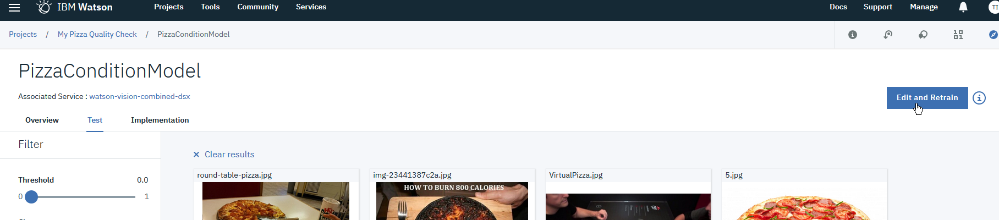

Click on Browser to load new_good_pizza_images.zip or drag and drop the .zip file on the top right side of the screen

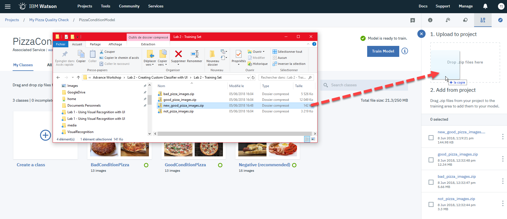

Drag and drop the **new_good_pizza_images.zip** data set to the **GoodConditionPizza** class, and then click on the **Train Model** button.

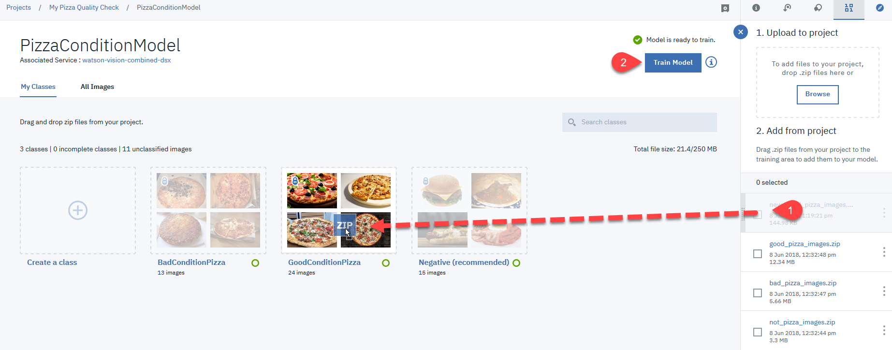

## Conclusion

This lab demonstrated the power of cognitive computing using IBM's Visual Recognition Service. In just a few minutes, you were able to train Watson to detect pizzas that were damaged versus a good quality
pizza. This quick tutorial demonstrated the power of custom image recognition that IBM Watson enables. Armed with this powerful technology, you can disrupt your industry in innovative ways that were previously too expensive and time consuming to endeavor.
