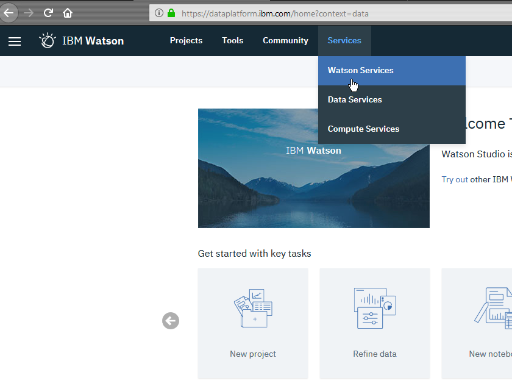
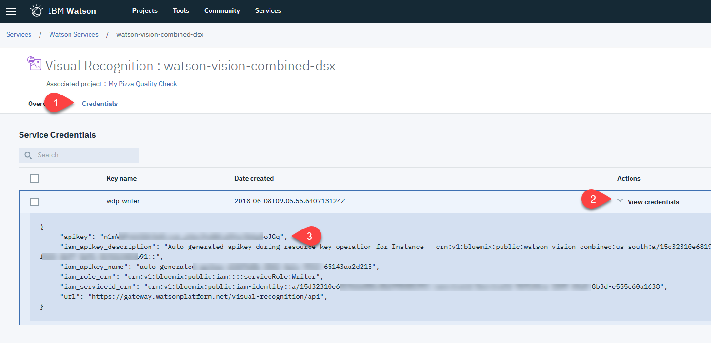
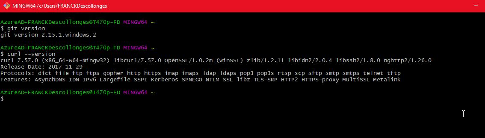
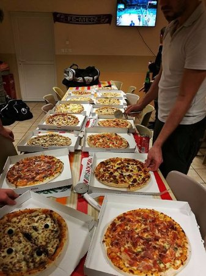

# Visual Recognition Workshop

# Lab3 : Using Visual Recognition APIs with command line

## Objectives : Discover Visual Recognition APIs

This lab aims to help you to discover Visual Recognition low level APIs with the command line and curl.

 This tutorial guides you through how to use some built-in classifiers in IBM Watson™ Visual Recognition  to classify an image and then detect faces in an image.

The full description of APIs is here : https://www.ibm.com/watson/developercloud/visual-recognition/api/v3/

## 0 - Before you begin
- Login to Watson Studio Website : https://dataplatform.ibm.com
- Select Watson Services from Services menu
- 

- Click on your Visual Recognition Service (named **watson-vision-combined-dsx**)
- On next screen, click on Credentials tab
- Copy and store the credentials to authenticate to your service instance
- Click on the arrow next to View credentials
- Copy the apikey value.
- 

On windows, you need **cURL**. I suggest to install **git** as it will be required in later labs. **git** comes with bash shell and cURL.

Download from here :  [https://](https://git-scm.com/downloads)[git-scm.com/downloads](https://git-scm.com/downloads)

Follow the installation instructions using the default options

On Windows, use **Git Bash shell** as command line terminal to execute all your scripts


 You can verify installation:

  `git version`

and

`curl --version`





## 1 - Classify an image
1. Go to `Lab3/Lab3 - Test Images` folder (you unzipped it from Lab_Material.zip)

1. Issue the following command to upload the image and classify it against all built-in classifiers:

    - Replace `{your_api_key}` with the service credentials you copied earlier.

    - Modify the location of the images\_file to point to the file of your choice or use

    - 


    ```bash
    curl -X POST -u "apikey:{your_api_key}" --form "images_file=@lab3_1.jpeg" "https://gateway.watsonplatform.net/visual-recognition/api/v3/classify?version=2018-03-19"
    ```
    The response includes the General model or classifier (which uses the `default` classifier_id), the classes identified in the image, and a score for each class.

    ```json
    {
        "images": [
            {
                "classifiers": [
                    {
                        "classifier_id": "default",
                        "name": "default",
                        "classes": [
                            {
                                "class": "athletic game",
                                "score": 0.81,
                                "type_hierarchy": "/sport/athletic game"
                            },
                            {
                                "class": "sport",
                                "score": 0.88
                            },
                            {
                                "class": "ball carrier (football)",
                                "score": 0.66,
                                "type_hierarchy": "/person/contestant/player/soccer (football) player/ball carrier (football)"
                            },
                            {
                                "class": "soccer (football) player",
                                "score": 0.66
                            },
                            {
                                "class": "player",
                                "score": 0.66
                            },
                            {
                                "class": "contestant",
                                "score": 0.768
                            },
                            {
                                "class": "person",
                                "score": 0.768
                            },
                            {
                                "class": "professional football",
                                "score": 0.559,
                                "type_hierarchy": "/sport/contact sport/professional football"
                            },
                            {
                                "class": "contact sport",
                                "score": 0.559
                            },
                            {
                                "class": "outdoor game",
                                "score": 0.529,
                                "type_hierarchy": "/sport/athletic game/outdoor game"
                            },
                            {
                                "class": "basketball",
                                "score": 0.5,
                                "type_hierarchy": "/person/contestant/basketball"
                            },
                            {
                                "class": "claret red color",
                                "score": 1
                            }
                        ]
                    }
                ],
                "image": "lab3_1.jpeg"
            }
        ],
        "images_processed": 1,
        "custom_classes": 0
    }
    ```
    Confidence scores are in the range of 0 to 1, with a higher score indicating greater correlation. By default, the `/v3/classify` calls don't include classes with a score below `0.5`. You can change the threshold for the minimum score

    Try to find the curl query to specify the threshold in the curl command. Check on https://www.ibm.com/watson/developercloud/visual-recognition/api/v3/curl.html?curl#get-classify

    Here is the result with a threshold of 0.75

    ```json
    {
        "images": [
            {
                "classifiers": [
                    {
                        "classifier_id": "default",
                        "name": "default",
                        "classes": [
                            {
                                "class": "athletic game",
                                "score": 0.81,
                                "type_hierarchy": "/sport/athletic game"
                            },
                            {
                                "class": "sport",
                                "score": 0.88
                            },
                            {
                                "class": "contestant",
                                "score": 0.768
                            },
                            {
                                "class": "person",
                                "score": 0.768
                            },
                            {
                                "class": "claret red color",
                                "score": 1
                            }
                        ]
                    }
                ],
                "image": "lab3_1.jpeg"
            }
        ],
        "images_processed": 1,
        "custom_classes": 0
    }
    ```

    The answer is :

    ```bash
    curl -X POST -u "apikey:{your_api_key}" --form "images_file=@lab3_1.jpeg" "https://gateway.watsonplatform.net/visual-recognition/api/v3/classify?version=2018-03-19&threshold=0.75"
    ```


## 2 - Detect faces in an image
Visual Recognition can detect faces in images. The response provides information such as the location of the face in the image and the estimated age range and gender for each face.

1. Use the provided **lab3_2.png** file or the picture with a person of your choice.

    

1. Issue the following command to the `POST /v3/detect_faces` method to upload and analyze the image. If you use your own image, the maximum size is 10 MB:
    - Replace `{your_api_key}` with the service credentials you copied earlier.
    - Optional : Modify the name of the images\_file to point to your image.

    ```bash
    curl -X POST -u "apikey:{your_api_key}" --form "images_file=@lab3_2.png" "https://gateway.watsonplatform.net/visual-recognition/api/v3/detect_faces?version=2018-03-19"
    ```
    You can see bellow the data returned by Watson Visual Recognition service. he response includes a location and age and gender estimates with scores. Scores range from 0-1, with a higher score indicating greater correlation.

    It also includes for each faces identified, the location and the size of the face in the object `face_location`


    ```json
    {
        "images": [
            {
                "faces": [
                    {
                        "age": {
                            "min": 23,
                            "max": 26,
                            "score": 0.8232041
                        },
                        "face_location": {
                            "height": 114,
                            "width": 96,
                            "left": 269,
                            "top": 255
                        },
                        "gender": {
                            "gender": "MALE",
                            "score": 0.99996686
                        }
                    },
                    {
                        "age": {
                            "min": 20,
                            "max": 22,
                            "score": 0.9996833
                        },
                        "face_location": {
                            "height": 110,
                            "width": 99,
                            "left": 475,
                            "top": 227
                        },
                        "gender": {
                            "gender": "MALE",
                            "score": 0.9999262
                        }
                    },
                    {
                        "age": {
                            "min": 20,
                            "max": 23,
                            "score": 0.96680456
                        },
                        "face_location": {
                            "height": 104,
                            "width": 100,
                            "left": 733,
                            "top": 286
                        },
                        "gender": {
                            "gender": "MALE",
                            "score": 0.9973078
                        }
                    },
                    {
                        "age": {
                            "min": 38,
                            "max": 41,
                            "score": 0.76757586
                        },
                        "face_location": {
                            "height": 78,
                            "width": 74,
                            "left": 662,
                            "top": 188
                        },
                        "gender": {
                            "gender": "FEMALE",
                            "score": 0.99947006
                        }
                    }
                ],
                "image": "lab3_2.png"
            }
        ],
        "images_processed": 1
    }
    
    ```


## 3 - Using Food (beta) model

Visual Recognition provides a beta food recognition model enhanced specificity and accuracy for images of food items. This is a specific training.

1. Use the provided **lab3_3.jpeg** file or the picture with a person of your choice.

   

2. Issue the following command to the `POST /v3/classify` using the classifier_ids parameter to use specifically the food model. This method will upload and analyze the image the specified model. If you use your own image, the maximum size is 10 MB:

   - Replace `{your_api_key}` with the service credentials you copied earlier.
   - Optional : Modify the name of the images\_file to point to your image.

   ```bash
    curl -X POST -u "apikey:{your_api_key}" --form "classifier_ids=food" --form "images_file=@lab3_3.jpeg" "https://gateway.watsonplatform.net/visual-recognition/api/v3/classify?version=2018-03-19"
   ```

   or

   ```bash
    curl -X POST -u "apikey:{your_api_key}"  --form "images_file=@lab3_3.jpeg" "https://gateway.watsonplatform.net/visual-recognition/api/v3/classify?version=2018-03-19&classifier_ids=food"
   ```


   ```json
   {
       "images": [
           {
               "classifiers": [
                   {
                       "classifier_id": "food",
                       "name": "food",
                       "classes": [
                           {
                               "class": "pizza",
                               "score": 0.787
                           },
                           {
                               "class": "sausage pizza",
                               "score": 0.5,
                               "type_hierarchy": "/pizza/sausage pizza"
                           }
                       ]
                   }
               ],
               "image": "lab3_3.jpeg"
           }
       ],
       "images_processed": 1,
       "custom_classes": 0
   }
   ```

3. You can call multiple classifiers in the same call and get results from all of them.

   ```bash
   curl -X POST -u "apikey:{your_api_key}" --form "classifier_ids=default, food" --form "images_file=@lab3_3.jpeg" "https://gateway.watsonplatform.net/visual-recognition/api/v3/classify?version=2018-03-19"
   ```

For example, the previous call will return classifications for both default model and food model i.e.

```json
{
    "images": [
        {
            "classifiers": [
                {
                    "classifier_id": "food",
                    "name": "food",
                    "classes": [
                        {
                            "class": "pizza",
                            "score": 0.787
                        },
                        {
                            "class": "sausage pizza",
                            "score": 0.5,
                            "type_hierarchy": "/pizza/sausage pizza"
                        }
                    ]
                },
                {
                    "classifier_id": "default",
                    "name": "default",
                    "classes": [
                        {
                            "class": "pizzeria",
                            "score": 0.966,
                            "type_hierarchy": "/building/retail store/shop/pizzeria"
                        },
                        {
                            "class": "shop",
                            "score": 0.966
                        },
                        {
                            "class": "retail store",
                            "score": 0.966
                        },
                        {
                            "class": "building",
                            "score": 0.966
                        },
                        {
                            "class": "banquet",
                            "score": 0.5,
                            "type_hierarchy": "/food/nutrition/meal/banquet"
                        },
                        {
                            "class": "meal",
                            "score": 0.501
                        },
                        {
                            "class": "nutrition",
                            "score": 0.502
                        },
                        {
                            "class": "food",
                            "score": 0.502
                        },
                        {
                            "class": "Indian red color",
                            "score": 0.704
                        },
                        {
                            "class": "light brown color",
                            "score": 0.516
                        }
                    ]
                }
            ],
            "image": "lab3_3.jpeg"
        }
    ],
    "images_processed": 1,
    "custom_classes": 0
}
```


## 4 - Privacy considerations

By default, all Watson services log requests and their results. Logging is done only to improve the services for future users. The logged data is not shared or made public. To prevent IBM from accessing your data for general service improvements, set the `X-Watson-Learning-Opt-Out` request header to `true` for all requests. (Any value other than `false` or `0` disables request logging for that call.) You must set the header on each request that you do not want IBM to access for general service improvements. 

Example :

```bash
curl -X POST 'X-Watson-Metadata: customer_id=abc1234' -H "X-Watson-Learning-Opt-Out: true" -u "apikey:{your_api_key}" --form "classifier_ids=default, food" --form "images_file=@lab3_3.jpeg" "https://gateway.watsonplatform.net/visual-recognition/api/v3/classify?version=2018-03-19"
```

Moreover, if you need to remove an individual customer's data (because of GDPR for instance) from a Visual Recognition service instance with multiple customers, you first need to associate that data with a unique **Customer ID** for each individual that may have provided data. To specify the Customer ID for any data sent using the `POST /classifiers` method, include the **X-Watson-Metadata: customer_id** property in your header.  

```bash
curl -X POST -H "X-Watson-Metadata: customer_id=abc1234" -u "apikey:{your_api_key}" --form "classifier_ids=default, food" --form "images_file=@lab3_3.jpeg" "https://gateway.watsonplatform.net/visual-recognition/api/v3/classify?version=2018-03-19"
```

**Note**: You are responsible for creating customer_ID values, and ensuring that each is unique.

Then you can delete all data previously collected for a customer using the following command :

```bash
curl -X DELETE -u "apikey:{your_api_key}" "https://gateway.watsonplatform.net/visual-recognition/api/v3/user_data?customer_id=abc1234&version=2018-03-19"
```
