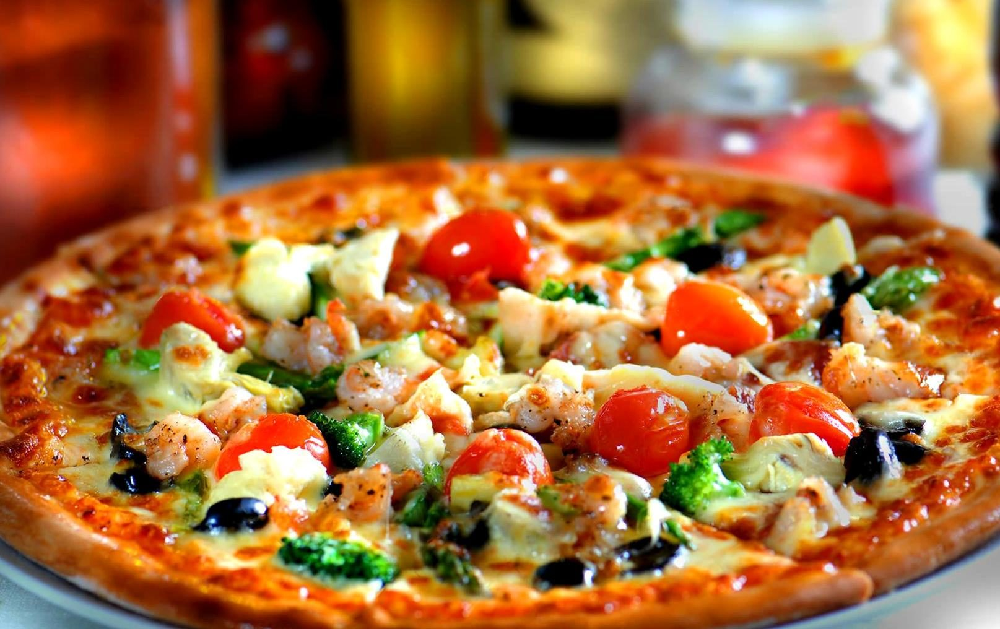
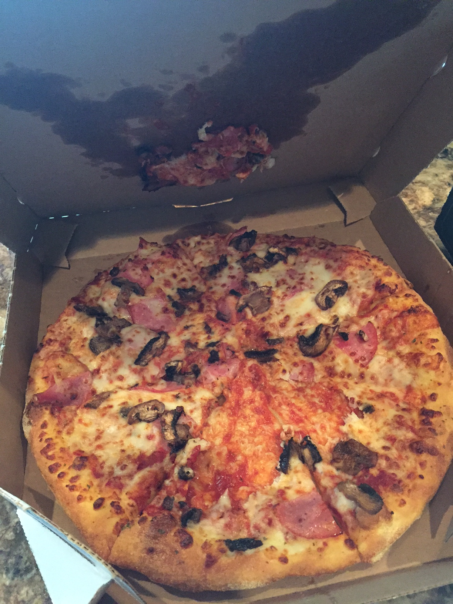

# Visual Recognition Workshop 

# Lab 4 : Create and retrain custom classifiers with APIs with command line

## Objectives : Learn how to use APIs to create custom Visual Recognition models

After you analyze an image in the "Lab 3 : Using Visual Recognition APIs with command line" lab, you are ready to train and create a custom model. With a custom model, you can train the  Visual Recognition service to classify images to suit your business needs.

Like in "**Lab2 - Create custom classifier with UI**", we will train Watson to detect that a customer's pizza is messed up (e.g. burned, toppings pushed to one side, cheese stuck to the box, etc.) versus a pizza that isn't. 

The goal is to illustrate how to use APIs to train and retrain custom models automatically. We will create with Command Line Interface (CLI) a new model called PizzaConditionModel_CLI.

## 0 - Before you begin
 If you didn't create a service instance, run through those steps from "**Lab 1 : Using Visual Recognition with UI**"

Then follow the "**Before you begin**" from "**Lab 3 : Using Visual Recognition APIs with command line**"

## 1 - Creating a custom model
Visual Recognition can learn from example images you upload to create a new, multi-faceted model. Each example file is trained against the other files in that call, and positive examples are stored as classes. These classes are grouped to define a single model, and return their own scores. Negative example files are not stored as classes.

The syntax is the following : 

```bash
curl -X POST -u "apikey:{your_api_key}" --form "{class1}_positive_examples=@{file1.zip}" --form "{class2}_positive_examples=@{file2.zip}" --form "negative_examples=@{negatives.zip}" --form "name={modelname}" "https://gateway.watsonplatform.net/visual-recognition/api/v3/classifiers?version=2018-03-19"
```

where : 

 `{your_api_key}` is the service credentials you copied in the first step.

`{class1}`, `{class2}` are classes names for your classification model

`{file1.zip}`, `{file2.zip}` are zip files containing images relative to respective classes

`{negatives.zip}` is a zip file containing negative examples

`{modelname}` is the name of the custom model

You need to include at least two sets of examples, either two positive example files (e.g. `{file1.zip} +` `{file2.zip}` ) or one positive and one negative file. (e.g. `{file1.zip}`+ `{negatives.zip}`)

Remember to specify a Customer ID by including the **X-Watson-Metadata: customer_id** property in your header if the data provided for training are related to a customer ( cf. Lab 3 part 4 - Privacy considerations )

#### Let's create our own model

Go to `Lab4/Lab4 - Training Set` folder (you unzipped it from Lab_Material.zip)

1. Call the `POST /v3/classifiers` method with the following command, which uploads the training data and creates a `dogs` custom model:
    - Replace `{your_api_key}` with the service credentials you copied in the first step.
    - Modify the location of the `{class}_positive_examples` to point to where you saved the .zip files.

    ```bash
    curl -X POST -u "apikey:{your_api_key}" --form "GoodConditionPizza_positive_examples=@good_pizza_images.zip" --form "BadConditionPizza_positive_examples=@bad_pizza_images.zip" --form "negative_examples=@not_pizza_images.zip" --form "name=PizzaConditionModel_CLI" "https://gateway.watsonplatform.net/visual-recognition/api/v3/classifiers?version=2018-03-19"
    ```
    Note : Positive example filenames require the suffix `_positive_examples`. In this example, the filenames are `GoodConditionPizza_positive_examples`, `BadConditionPizza_positive_examples`. The prefix (GoodConditionPizza and BadConditionPizza) is returned as the name of class.

    The response includes a new classifier ID and status, for example:

    ```json
    {
        "classifier_id": "PizzaConditionModel_CLI_111484768",
        "name": "PizzaConditionModel_CLI",
        "status": "training",
        "owner": "4139b8c2-f4f4-4b97-8d91-019263483b91",
        "created": "2018-06-11T08:08:46.203Z",
        "updated": "2018-06-11T08:08:46.203Z",
        "classes": [
            {
                "class": "BadConditionPizza"
            },
            {
                "class": "GoodConditionPizza"
            }
        ],
        "core_ml_enabled": true
    }
    
    ```

1. Check the training status periodically until you see a status of `ready`. Training begins immediately and must finish before you can query the model. Replace `{your_api_key}` and `{classifier_id}` with your information:

    ```bash
    curl -X GET -u "apikey:{your_api_key}" "https://gateway.watsonplatform.net/visual-recognition/api/v3/classifiers/{classifier_id}?version=2018-03-19"
    ```
    ```json
    {
        "classifier_id": "PizzaConditionModel_CLI_111484768",
        "name": "PizzaConditionModel_CLI",
        "status": "ready",
        "owner": "4139b8c2-f4f4-4b97-8d91-019263483b91",
        "created": "2018-06-11T08:08:46.203Z",
        "updated": "2018-06-11T08:08:46.203Z",
        "classes": [
            {
                "class": "BadConditionPizza"
            },
            {
                "class": "GoodConditionPizza"
            }
        ],
        "core_ml_enabled": true
    }
    ```

    Copy the `classifier_id` **value** as it will be used in next step. In the example, the value  is : `PizzaConditionModel_CLI_111484768`

## 2 - Classifying an image with a custom model

When the new model is ready, call it to see how it performs.

1. Go to `Lab4/Lab4 - Test Images` folder (you unzipped it from Lab_Material.zip)

   

2. Use the `POST /v3/classify` method to test your custom model. The following example classifies the `pizza1.jpg` image against your custom model 

   - Replace `{your_api_key}` with the service credentials you copied in the first step.
   - Replace `{your_classifier_id}` with the id copied from previous step.

   ```bash
   curl -X POST -u "apikey:{your_api_key}" --form "images_file=@pizza1.jpg" --form "classifier_ids={your_classifier_id}" "https://gateway.watsonplatform.net/visual-recognition/api/v3/classify?version=2018-03-19"
   ```

   The response includes classifiers (models), their classes, and a score for each class. Scores range from 0-1, with a higher score indicating greater correlation. The `/v3/classify` calls omit low-scoring classes by default if high-scoring classes are identified. You can set a minimum score to display by specifying a floating point value for the `threshold` parameter in your call.

   ```json
   {
       "images": [
           {
               "classifiers": [
                   {
                       "classifier_id": "PizzaConditionModel_CLI_111484768",
                       "name": "PizzaConditionModel_CLI",
                       "classes": [
                           {
                               "class": "GoodConditionPizza",
                               "score": 0.906
                           }
                       ]
                   }
               ],
               "image": "pizza1.jpg"
           }
       ],
       "images_processed": 1,
       "custom_classes": 2
   }
   ```

   To classify against multiple classifiers, update the list of classifier_ids as needed.

   For example, to classify `pizza2.jpg`  with both your custom model **and** food (beta) model use : 

   

   ```bash
   curl -X POST -u "apikey:{your_api_key}" --form "images_file=@pizza1.jpg" --form "classifier_ids={your_classifier_id},food" "https://gateway.watsonplatform.net/visual-recognition/api/v3/classify?version=2018-03-19"
   ```

   

   ```json
   {
       "images": [
           {
               "classifiers": [
                   {
                       "classifier_id": "food",
                       "name": "food",
                       "classes": [
                           {
                               "class": "pepperoni pizza",
                               "score": 0.637,
                               "type_hierarchy": "/pizza/pepperoni pizza"
                           },
                           {
                               "class": "pizza",
                               "score": 1
                           },
                           {
                               "class": "cheese pizza",
                               "score": 0.632,
                               "type_hierarchy": "/pizza/cheese pizza"
                           },
                           {
                               "class": "sausage pizza",
                               "score": 0.5,
                               "type_hierarchy": "/pizza/sausage pizza"
                           }
                       ]
                   },
                   {
                       "classifier_id": "PizzaConditionModel_CLI_111484768",
                       "name": "PizzaConditionModel_CLI",
                       "classes": [
                           {
                               "class": "BadConditionPizza",
                               "score": 0.866
                           }
                       ]
                   }
               ],
               "image": "pizza2.jpg"
           }
       ],
       "images_processed": 1,
       "custom_classes": 2
   }
   
   ```

   Review your results. 

## 3 - Updating an existing custom model

You can update a custom model either by adding classes to the model or by adding images to an existing class. Here, you improve the model that you created in step 2 by adding new images to an existing class. You could also add images the negative example set for the "PizzaConditionModel" custom model by adding another zip file to the negative_examples parameter (not done in this example).

You must supply at least one set of positive or negative examples.

1. Go back to `Lab 4/Lab 4 - Training Set` folder (you unzipped it from Lab_Material.zip)

1. Call the `POST /v3/classifiers/{classifier_id}` method with the following cURL command, which uploads the training data and updates the custom model `{your_classifier_id}`:

    - Replace `{your_api_key}` with the service credentials you copied in the first step.
    - Replace `{your_classifier_id}` with the ID of the custom model you want to update.
    - Modify the location of the `{class}_positive_examples` to point to where you saved the .zip files.

    ```bash
    curl -X POST -u "apikey:{your_api_key}" --form "GoodConditionPizza_positive_examples=@new_good_pizza_images.zip" "https://gateway.watsonplatform.net/visual-recognition/api/v3/classifiers/{your_classifier_id}?version=2018-03-19"
    ```
    The existing "dogs" custom model is replaced by the retrained one with the same classifier_id. The response lists the new set of classes and the current status. For example:

    ```json
    {
        "classifier_id": "PizzaConditionModel_CLI_111484768",
        "name": "PizzaConditionModel_CLI",
        "status": "retraining",
        "owner": "4139b8c2-f4f4-4b97-8d91-019263483b91",
        "created": "2018-06-11T08:08:46.203Z",
        "updated": "2018-06-11T08:08:46.203Z",
        "classes": [
            {
                "class": "BadConditionPizza"
            },
            {
                "class": "GoodConditionPizza"
            }
        ],
        "core_ml_enabled": true
    }
    
    ```
    Training begins immediately. When the new one is available, the status changes to `ready`.

    Don't issue another retraining request until after the current status `ready` state. Multiple requests to retrain a model result in a single retraining taking effect. A timestamp called `updated` shows the time that the model was most recently updated. If you call the `/classify` method while the model is retraining, the old definition of the model is used.

1. Check the training status periodically until you see a status of `ready`. Replace `{your_api_key}` and `{classifier_id}` with your information:

    ```bash
    curl -X GET -u "apikey:{your_api_key}" "https://gateway.watsonplatform.net/visual-recognition/api/v3/classifiers/{classifier_id}?version=2018-03-19"
    ```

    ```json
    {
        "classifier_id": "PizzaConditionModel_CLI_111484768",
        "name": "PizzaConditionModel_CLI",
        "status": "ready",
        "owner": "4139b8c2-f4f4-4b97-8d91-019263483b91",
        "created": "2018-06-11T08:08:46.203Z",
        "updated": "2018-06-11T09:00:02.705Z",
        "classes": [
            {
                "class": "BadConditionPizza"
            },
            {
                "class": "GoodConditionPizza"
            }
        ],
        "retrained": "2018-06-11T09:00:02.705Z",
        "core_ml_enabled": true
    }
    
    ```


## 4 - Query list of custom model

```bash
curl -X GET -u "apikey:{your_api_key}" "https://gateway.watsonplatform.net/visual-recognition/api/v3/classifiers?version=2018-03-19&verbose=true"
```

```JSON
{
    "classifiers": [
        {
            "classifier_id": "PizzaConditionModel_614667364",
            "name": "PizzaConditionModel",
            "status": "ready",
            "owner": "4139b8c2-f4f4-4b97-8d91-019263483b91",
            "created": "2018-06-08T10:46:39.749Z",
            "updated": "2018-06-08T11:30:35.777Z",
            "classes": [
                {
                    "class": "BadConditionPizza"
                },
                {
                    "class": "GoodConditionPizza"
                }
            ],
            "retrained": "2018-06-08T11:30:35.777Z",
            "core_ml_enabled": true
        },
        {
            "classifier_id": "PizzaConditionModel_CLI_111484768",
            "name": "PizzaConditionModel_CLI",
            "status": "ready",
            "owner": "4139b8c2-f4f4-4b97-8d91-019263483b91",
            "created": "2018-06-11T08:08:46.203Z",
            "updated": "2018-06-11T09:00:02.705Z",
            "classes": [
                {
                    "class": "BadConditionPizza"
                },
                {
                    "class": "GoodConditionPizza"
                }
            ],
            "retrained": "2018-06-11T09:00:02.705Z",
            "core_ml_enabled": true
        }
    ]
}
```

You should have 2 custom models. The one created interractively with the Visual Recognition tooling, and the one created in this lab.

## 5 - Deleting your custom model

We will now delete the custom model we just created to keep only the first custom model created with the tooling. We will reuse it in following labs.

To delete the model, call the `DELETE /v3/classifiers/{classifier_id}` method. Replace `{your_api_key)` and `classifier_id` with your information. 

Be sure to select the classifier_id starting with : **<u>PizzaConditionModel_CLI</u>**

```bash
curl -X DELETE -u "apikey:{your_api_key}" "https://gateway.watsonplatform.net/visual-recognition/api/v3/classifiers/{classifier_id}?version=2018-03-19"
```
You're done! You created, trained, retrained, queried and deleted a custom model with Watson Visual Recognition APIs.

All SDKs available in various languages and platform  (Java, Node.js, Python, .NET, Swift, Android, Unity, OpenWhisk, Salesforce (APEX) ) are wrappers around these methods.

For Swift, the Watson Swift SDK support offline images classification using Apple CoreML. It will be detailled in a later lab.
