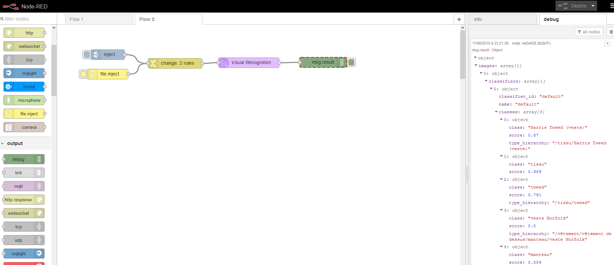
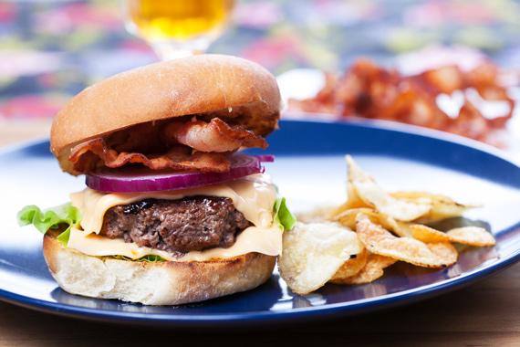
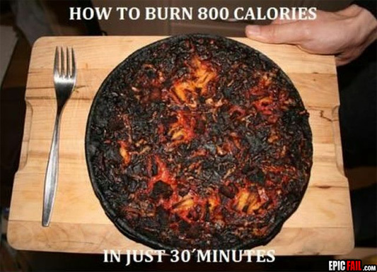
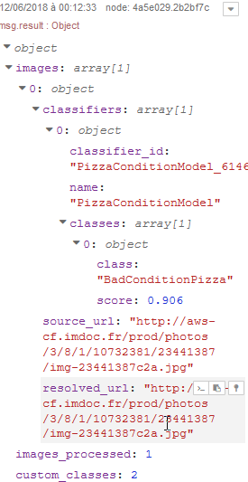

# Visual Recognition Workshop 

# Lab 5 : Integrate Visual Recognition in your application with Node-Red

## Objectives : Learn how to integrate easily Visual Recognition in your prototypes / projects with Node-RED

### Introduction

[Node-RED](http://nodered.org) is a visual tool for wiring the Internet of Things. It is easy to connect devices, data and api’s (services). It can also be used for other types of applications to quickly assemble flows of services. Node-RED is available as open source and has been implemented by the IBM Emerging Technology organization.
Node-RED provides a browser-based flow editor that makes it easy to wire together flows using the wide range of nodes in the palette. Flows can be then deployed to the runtime in a single-click.
While Node-Red is based on Node.js, JavaScript functions can be created within the editor using a rich text editor.
A built-in library allows you to save useful functions, templates or flows for re-use.

Node-RED is included in the Node-RED starter application in [IBM Cloud](http://ibm.biz/bluemixnl) (IBM Cloud is IBM’s Platform as a Service, free of charge) but you can also deploy it as a stand alone Node.js application.
Node-RED can not only be used for IoT applications, but it is a generic event-processing engine. For example, you can use it to listen to events from http, websockets, tcp, Twitter (and more!) and store this data in databases without having to program much, if at all. You can also use it to implement simple REST APIs. You can find many other sample flows on the [Node-RED website](http://flows.nodered.org).

In this labs, we focus on applications which make use of IBM Watson Visual Recognition capabilities.

Nodes are blocks that represent components of a larger system, in Node-RED's case usually the devices, software platforms and web services that are to be connected. Further blocks can be placed in between these components to represent software functions that wrangle and transform the data in transit.

## 0 - Getting Started

There are two ways of using Node-RED
-	Node-RED stand alone (described in appendix)
		Node-RED on [IBM Cloud](http://ibm.biz/bluemixnl) (IBM Cloud is IBM’s Platform as a Service)

Both ways are described in this article, but to save time for these labs and to enable access from internet for mobile devices,  it is recommended to use Node-RED on IBM Cloud.

Note that Node-RED in IBM Cloud will behave slightly differently than Node-RED stand-alone:

- The sets of available nodes differ, IBM Cloud has extra nodes for DB access, but does not expose the File nodes.
- Node-RED in IBM Cloud stores its persistent data (flows, libraries, credentials) in the co-installed Cloudant database named nodered. When using a Cloudant node with Node-RED on IBM Cloud, the list of available instances is automatically listed.
- Node-RED in IBM Cloud has built-in credential management, so you don't have to worry about exposing your services authentication data, they will be filled-in automatically from the services' credentials defined for the application in IBM Cloud.

#### Deploy Node-RED on IBM Cloud

- Log in IBM Cloud and access your Dashboard with the following URL : https://console.bluemix.net/dashboard/apps


- When you are logged in, click on "Create Ressources" and search for 'Node-RED starter', which can be found under boilerplates.

  

- Click the service to create it

- Enter an app name, which must be unique i.e. VisualRecognitionWS-{your_lastname} 

  - Replace {your_lastname} by your last name

  

- Choose US South as Region, organization and space to deploy in
- Click 'Create'.
  The Node-RED application will be created and deployed. This will take a few minutes. 


- When it has finished, click on the URL which opens up your Node-RED application.

 

Follow instructions to setup your node-red instance.

For these labs, you can keep your editor insecure, but in other cases, you should provide a useid / password to protect your developments.


You should reach the following screen : 


Click on Go to your `Node-RED flow editor` button to start


You are now ready to create your first node-RED application.

For more information about node-RED, go to https://nodered.org/docs/

## 1 - STEP 1 : Node-RED Watson Visual Recognition Node

The Node-RED  node provides a very easy wrapper node that takes an image URL or binary stream as input, and produces a set of image labels as output. 

- Drag and Drop the node on the canvas, and double click on it to see the options

- Define the payload type as string by clicking on the little arrow, and set the payload value to : https://watson-visual-recognition-duo-dev.ng.bluemix.net/images/classify/small/computer_chip.jpg

   

- 

  - This will inject this URL as a string when the inject node is initiated


- Click on **Done** to save and close this node.
- Click on **filter nodes** and search for "*visual*" :


- Drag and drop the  node next to the previous node on the canvas and double click on it to open the properties pane.

- Copy the credentials from Visual Recognition Service created in **"Lab 1 - Using Visual Recognition with UI"**
  - go to https://dataplatform.ibm.com/data/services?target=watson
  - click on you visual recognition instance (watson-vision-combined-dsx)
  - click on **Credentials** tab and **View credentials**
  - copy the `apikey` value

- Paste the credential from previous labs  in the API Key field

- Select https://gateway.watsonplatform.net/visual-recognition/api from the dropdown next to Service Endpoint
  - This field is for compatibility purpose with older version of the Visual Recognition service instances, created before the 25th of may 2018. These instances are deprecated and will be deleted soon.
  - As we just created a new instance, we are using the new default endpoint


- We first use the "default" classifier as defined in the **Detect** field. 
  - Late in this lab, we will use other type of classifiers

- Click **Done**

- Link inject node with visual recognition node

- Drag  node from output drawer and drop it next to visual recognition node. Link them together


- The debug node display the content of the msg (or subset of it) in the debug pane of the Node-RED UI. We need to change the root of the object we want to see in the debug pane.
  - Double click on the **msg.payload** debug node to open its options and choose complte msg object in the output dropdown. Click on **Done** to save and close the option editor.

  

- Click on  on the top right part of the screen to deploy the flow to the Node-RED runtime
  - You should see : Successfully deployed. Your application using Visual Recognition is ready to be tested

  

- Click on the square next to the inject node. By doing so, it will set the payload part of the msg object as the image URL ( https://watson-visual-recognition-duo-dev.ng.bluemix.net/images/classify/small/computer_chip.jpg )  we want to send to Visual Recognition

  - Node-RED is based on a `msg` object that "flows" from one node to another. 
    - Each node can use all the `msg` object, or subpart of it to do its processing. 
    - Each node must send back the `msg` object with updated content, or a new content.
    - The "main" part of the `msg` object is the `msg.payload` part
    - Watson Visual Recognition is loading the image from the `msg.payload` URL, and classifying the image with the specified classifier (here the default classifier)
    - Watson Visual Recognition node return its results in the `msg.result` object.
    - Debug node displays the msg object in the debug tab 

  - Expand the msg object to discover the datastructure of msg.result

    You can see, it is the same as what we have seen in the previous lab, using the APIs.

    


- You can now change the images to send to Visual Recognition by changing the URL of the inject node.

- You can also test the Face detection model

- To test with local files, you can use "Browser Utils" nodes from Node-RED. As they are not provided by IBM (but by the large Node-RED community), you have to install these extra node to you Node-RED instance.

  - Select **Manage palette** from the hamburger menu on the top right part of the screen

    

  - On the **Install tab**, search for browser

  - Click **install** twice to add the `node-red-contrib-browser-utils` nodes to your Node-RED instance

    

    

  - 3 new nodes are now available in the input drawer

    

  - You can use them to test the visual recognition service and check the results in the debug tab. Important : Maximum image size is 2MB

    

  - Here is an example of using the camera input with Face detection model

    


Now you understand the basic usage of Node-RED and Visual Recognition node. In next step, we will dig into the various parameters of the Visual Recognition node, and discover how to set them programmatically.

## 2 - STEP 2 : Use custom parameters with Visual Recognition node

In this part, we will discover how to set the parameters of the Visual Recognition node

We will use the node to define some part of the `msg` object that will be used by Visual Recognition node. 

- `msg.params["detect_mode"]` : A setting of "classify" or "faces" indicating the visual recognition feature required. "Default" is "classify" (string) (Optional)
- `msg.params["classifier_ids"]` : A comma-separated list of the classifier IDs used to classify the images. "Default" is the classifier_id of the built-in classifier. (string) (Optional)
- `msg.params["owners"]` : A comma-separated list with the value(s) "IBM" and/or "me" to specify which classifiers to run. (string) (Optional)
- `msg.params["threshold"]` : A floating value (in string format) that specifies the minimum score a class must have to be displayed in the response (Optional)
- `msg.params["accept_language"]` : Specifies the language of the output class names. Can be 'en' (English as default), 'es' (Spanish), 'ar' (Arabic) or 'ja' (Japanese). Classes for which no translation is available are omitted. If specified, it overrides the language specified in the node configuration (Optional)

To start, we will create a new page in the Node-RED UI. Click on `+` near the info tab, to create a new page. It will create a **Flow 2** tab with an empty canvas


- Insert on the canvas a **inject** node, a **file inject** node, a **change** node, a **visual recognition** node and a **debug** node like the following diagram

  

- Set the payload value of the **inject** node to the following string : https://watson-visual-recognition-duo-dev.ng.bluemix.net/images/classify/small/tweed_jacket.jpg

   

- 

  

- Define the value of the `msg.params["detect_mode"]` to "**classify**" and `msg.params["accept_language"]` to "**fr**" as follow. These settings will override the settings of the following Visual Recognition node

  - By doing so, we force the usage of the default classifier of Visual Recognition, and we set the language of the results to french.
  - The **Classify images** method of  Visual Recognition currently supports English (`en`), Arabic (`ar`), German (`de`), Spanish (`es`), French (`fr`), Italian (`it`), Japanese (`ja`), and Korean (`ko`) for the output of `default` classes. 

  

  (hint : click on the `+ add` button on the bottom of the node properties tab)

- Specify the **API Key** and the **Service Endpoint** parameters of the **Visual Recognition** node (like in previous step)

  

- Define the root of the debug message to msg.result as we will only focus on the results of the Visual Recognition service

  

- Hit Deploy and you should have the following screen : 

  

- **Inject** the provided URL to have the following result (or use your own images with the **file inject** node ) :

  

- Use the **camera**, **inject** and **change** nodes to use the Faces detection model

  - You can use this URL for the inject node : https://watson-visual-recognition-duo-dev.ng.bluemix.net/images/classify/small/faces.jpg

     

  - Set the `msg.params["detect_mode"]` to "**faces**" to force the faces detection model of Visual Recognition

    

- You should have the following flow : 

  

- **Deploy** your flow and test with the **inject** node to have the following result. You can also test with you own webcam to check if the age estimate is correct for you. Remember that the lights might play a big role in the estimation ;-)

  

- Let's use the food model :

  - Use an **inject** node and **change** node

    - URL for inject could be : https://picturecorrect-wpengine.netdna-ssl.com/wp-content/uploads/2014/05/professional-food-photos-1.jpg

       

    - To use food model, you have to set `msg.params["classifier_ids"]` to "food" in the **change** node. As you notice, this parameters will allow us to choose our custom classifiers. You can specify multiple classifier like "food,default"

    - Here is the flow and the expected result :

      

      

- Next, we will use the node to list all the custom classifier available. We should find our **PizzaConditionModel** defined in previous labs

  - Add an **inject** node, **visual recognition <u>util</u>** node and a **debug** node

  - The payload of the inject node is not important in this case as we will only list all classifiers availabe

  - Set the following properties of the **visual recognition util** node. **Detect** property should be set to "Retreive a list of classifiers"

    

    (don't forget to copy the API Key and change the Service Endpoint)

  - Here is the expected flow and expected results :

    

    

    You can copy and past the classifier_id, as we will use it next

  - As a test, you can try to get the details of the "PizzaConditionModel" with **Visual Recognition Util** node

  - With this node, you can also create / retrain your custom classifier. Here are the parameters :

    - `msg.params["name"]` : a string name that will be used as prefix for the returned classifier_id (Required) 
    - `msg.params["{classname}_positive_examples"]` : One or more  Node.js binary Buffer of the ZIP that contains a minimum of 10 images. (Required) 
    - `msg.params["negative_examples"]` : a Node.js binary Buffer of the ZIP that contains a minimum of 10 images (optional)

- Now, we will use our custom classifier

  - Insert 2 **inject** nodes : 

    - "Good Pizza" **inject** node : http://www.delonghi.com/Global/recipes/multifry/pizza_fresca.jpg (change the name of the node for better understanding of the flow)

       

    - "Bad Pizza" **inject** node : http://aws-cf.imdoc.fr/prod/photos/3/8/1/10732381/23441387/img-23441387c2a.jpg (change the name of the node for better understanding of the flow)

       

  - Insert one **change** node :

    -  With the **change** node, set `msg.params["classifier_ids"]` to your own classifier id (copied in previous step)

      

  

   


## 3 - STEP 3 : Exercise : Create a flow with multiple Visual Recognition models

Usually, classification if a multistep process. First you use a generic classification model. If the generic classifier identify something of interest, then you can apply a specific classifier.

In this step, you will have to create your own flow. This flow will first check if there is a pizza on the picture. If yes, it will check if the pizza is in good condition or not.

Before starting, it is better to click on `+` near the info tab, to create a new page, and start in **Flow 3** empty canvas.

Hint : You probably need to use a function node to evaluate the result of the generic classifier. 

Here is a sample of code configuration for such a node : 


```javascript
const classes = msg.result.images[0].classifiers[0].classes
const resultat = classes.find( classes => classes.class === 'pizza');
if (resultat) {
    msg.isPizza = resultat.score;
    return [msg,null];
} else {
    msg.isPizza = 0;
    msg.payload ="No pizza found";
    return [null,msg];
}
```


## 4 - STEP 4 : Create a mobile / web application that leverage Visual Recognition

In this step, we will create a web application, targetting mobile devices, to use Visual Recognition in a mobile situation. 

Imagine a pizza delivry man that is delivering a pizza.The customer is complaining about the condition of the pizza he just receive. The delivry man can use this web site on his mobile to evaluate the damages on the pizza and propose a commercial offering to the customer.

We provide a canvas for a sample web application. As the target of this workshop is not to teach Node-RED nor HTML / Javascript development, you will import in node-RED a simple version of the application in a first step to discover how it works.

Next, you will import a richer web application that you will customize to use the PizzaConditionModel.

- Click on `+` near the info tab, to create a new page, and start in **Flow 4** empty canvas.

- Copy the following code. It's a node-RED flow exported as JSON (available in `Lab5/Lab5  Node-red_Flow Step4.json` file)

  ```JSON
  [{"id":"fd1a6e45.7cdfe","type":"template","z":"c25ff95f.a77358","name":"HTML & JS","field":"payload","fieldType":"msg","format":"html","syntax":"plain","template":"<html>\n<body>\n\n    <H3>Visual Recognition Workshop</H3>\n    <H4>Node-Red demonstration</H4>\n    <input id=\"picture\" type=\"file\" accept=\"image/*;capture=camera\">\n    <div id=\"results\"></div>\n    \n    <script>\n        var formData = new FormData();\n        var myInput = document.getElementById('picture');\n        \n        function sendPic() {\n            var request = new XMLHttpRequest();  \n            var file = myInput.files[0];   \n            formData.set(\"photo\", file);\n            // Display results\n            request.onreadystatechange = function() {\n                console.log(this);\n                if (this.readyState == 4 && this.status == 200) {                    \n                    document.getElementById(\"results\").innerHTML = this.response;\n                }\n            };\n            // Sending picture to IBM Cloud\n            request.open(\"POST\", \"/submit\");\n            request.send(formData);\n        }\n        // Listener on picture selection\n        myInput.addEventListener('change', sendPic, false);\n    </script>\n    \n</body>\n</HTML>\n\n\n\n\n","output":"str","x":393,"y":123,"wires":[["cf187695.9f5e7"]]},{"id":"a70203d9.5875f","type":"http in","z":"c25ff95f.a77358","name":"","url":"/pizzachecker","method":"get","upload":false,"swaggerDoc":"","x":204,"y":123,"wires":[["fd1a6e45.7cdfe"]]},{"id":"cf187695.9f5e7","type":"http response","z":"c25ff95f.a77358","name":"","statusCode":"","headers":{},"x":553,"y":123,"wires":[]},{"id":"3519713a.d7cbde","type":"http in","z":"c25ff95f.a77358","name":"","url":"/submit","method":"post","upload":true,"swaggerDoc":"","x":184,"y":243,"wires":[["2ef477f1.83ca18"]]},{"id":"c3f4f2de.3aa2c","type":"http response","z":"c25ff95f.a77358","name":"","statusCode":"","headers":{},"x":997,"y":243,"wires":[]},{"id":"6f6eb88a.147c78","type":"visual-recognition-v3","z":"c25ff95f.a77358","name":"","apikey":"n1mVWPnkkSGh3mXLvum_ykboJhsNALaOVscSb6p6oJGq","vr-service-endpoint":"https://gateway.watsonplatform.net/visual-recognition/api","image-feature":"classifyImage","lang":"en","x":640,"y":243,"wires":[["5b9bd312.20a82c"]]},{"id":"5b9bd312.20a82c","type":"template","z":"c25ff95f.a77358","name":"HTML Result","field":"payload","fieldType":"msg","format":"handlebars","syntax":"mustache","template":"        <h4>Node-RED Watson Visual Recognition output</h4>\n        <table border='1'>\n            <thead><tr><th>Name</th><th>Score</th></tr></thead>\n        {{#result.images.0.classifiers.0.classes}}\n        <tr><td><b>{{class}}</b></td><td><i>{{score}}</i></td></tr>\n        {{/result.images.0.classifiers.0.classes}}\n        </table>\n","output":"str","x":836,"y":243,"wires":[["c3f4f2de.3aa2c"]]},{"id":"2ef477f1.83ca18","type":"change","z":"c25ff95f.a77358","name":"Get image from request","rules":[{"t":"set","p":"payload","pt":"msg","to":"req.files[0].buffer","tot":"msg"}],"action":"","property":"","from":"","to":"","reg":false,"x":404,"y":243,"wires":[["6f6eb88a.147c78"]]},{"id":"4beb83e6.4f25e4","type":"comment","z":"c25ff95f.a77358","name":"Mobile App to Upload picture","info":"","x":234,"y":83,"wires":[]},{"id":"562e6cac.f8d224","type":"comment","z":"c25ff95f.a77358","name":"Processing","info":"","x":174,"y":203,"wires":[]}]
  ```

- From the hamburger menu, on the top right of the page, select Import / Clipboad


- Paste code into the form and click on **Import**

  

- Drop the node on the canvas

- Configure **Visual Recognition** node with your credentials

- Take time to understand the logic of these nodes :

  - The top flow is handling the client side
    - It listens on the */pizzachecker* URI and serve the content of the **HTML & JS** template node
  - The bottom flow is handling the server side
    - It handles the POST request on */submit*, extract the parameters of the HTML request (**Get image from request** node, send it to **Visual Recognition** node, and send back to the browser the results formatted in HTML (**HTML Result** template node)

- Check and copy the hostname {node-RED_hostname} of your instance node-RED in the address bar of your browser.

- Open a new tab in you web browser (or use you mobile phone) and go to the following URL : https://{node-RED_hostname}/pizzachecker

  

  - Select a picture from your hard drive, and the mobile app will display the result of the Default classifier of Watson Visual Recognition

  - On your mobile phone, you can take a picture with you smartphone camera

  


We can improve a little bit the UI of the Web Application to show the picture we want to analyse and display status of the query.

- Replace the content of th **HTML & JS** node with the following code (available in the `Lab5/Lab5 Node-red HTML_JS Step4.txt` file). Feel free to exerce you HTML / CSS skills to improve the UI

```html
<html>
<head>
    <title>Visual Recognition Pizza Checker</title>
    <meta name="viewport" content="width=device-width, initial-scale=1">
    <link rel="stylesheet" href="https://code.jquery.com/mobile/1.4.0/jquery.mobile-1.4.0.min.css" />
    <script src="https://code.jquery.com/jquery-1.9.1.min.js"></script>
    <script src="https://code.jquery.com/mobile/1.4.0/jquery.mobile-1.4.0.min.js"></script>
</head>
<body>
    <H3>Visual Recognition Workshop</H3>
    <H4>Pizza Checker</H4>
    <input id="picture" type="file" accept="image/*;capture=camera">
    <p>
    <div id="view_pic"></div>
    <div id="results"></div>
    
    <script>
        var formData = new FormData();
        var myInput = document.getElementById('picture');
        
        function sendPic() {
            var request = new XMLHttpRequest();    
            
            //Displaying Picture
            var file = myInput.files[0];
            var reader = new FileReader();
            reader.onload = function (e) { 
                console.log(e); 
                document.getElementById("view_pic").innerHTML = "";
            }
            reader.readAsDataURL(file);
            formData.set("photo", file);
            
            // Showing Upload progress
            request.upload.addEventListener("progress", function(evt){
                if (evt.lengthComputable) {
                    console.log("add upload event-listener" + evt.loaded + "/" + evt.total);
                    document.getElementById("results").innerHTML = "Uploading to IBM Cloud <BR> <progress value='"+evt.loaded+"' max='"+evt.total+"'>";
                }
            }, false);
            
            // Showing analysis progress
            request.upload.addEventListener("load", function(evt){
                    document.getElementById("results").innerHTML = "Watson is analyzing the picture...";
            }, false);
            
            

            // Display results
            request.onreadystatechange = function() {
                console.log(this);
                if (this.readyState == 4 && this.status == 200) {                    
                    document.getElementById("results").innerHTML = this.response;
                }
            };
            
            // Sending picture to IBM Cloud
            request.open("POST", "/submit");
            request.send(formData);
        }
        
        // Listener on picture selection
        myInput.addEventListener('change', sendPic, false);
    </script>
</body>
</HTML>


```


##### **It's up to you.** 

Now you have to modify this application to use the custom classifier to display it the pizza is in good or bad condition. 

Here is a sample result :

   


## 5 - STEP 5 (Optional) : Integrate with other Watson Services (Watson Language Translator)

## Appendix : Installation and running Node-RED localy (Optional)

These are the instructions for installing Node-Red in the stand-alone way of working. If you are using Node-RED in IBM Cloud, skip this part as nothing has to be installed, instead you need to deploy a Node-RED boilerplate.

#### Deploy Node-RED stand alone

Node.js is a pre-requisite for Node-Red.

Follow instruction on https://nodejs.org/en/ to install NodeJS on your platform.

When you have Node.js installed, run:

For Linux/OS X

```
$ sudo npm install -g node-red
```

For Windows

```
npm install -g node-red
```

Note: you need to run in a command shell as Administrator,

The default instance of Node-RED does not contain the IBM Watson services which we need in the labs, so the next step is to install these services:

You simply execute this command:

```
npm install node-red-bluemix-nodes
```

When finished start Node-RED:

For Linux/OS X:

```
$ node-red
```

For Windows

```
node node_modules/node-red/red.js
```

 Then open [http://localhost:1880](http://localhost:1880)

Check out [this page](http://nodered.org/docs/getting-started/) for full instructions on getting started with Node-RED.
