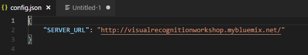

# Visual Recognition Workshop

# Lab 6 - Create an Android (or iOS) application with Cordova accessing Visual Recognition

In this developer code pattern, we will create a mobile app using Apache Cordova, Node-RED and Watson Visual Recognition. This mobile app sends pictures of issues with pizza delivery to be analyzed by a server app, using Watson Visual Recognition.

The server application running on Node-RED will use the custom classifier we created in previous labs

## 1. Prepare your Node-RED Server

We will extend the Lab5 - Step4 to handle requests from the mobile app.

### Step 1 - Prerequisites

If you didn't complete Lab5 until the end of step 4, you need to import the result of Lab5 to a empty Node-RED canvas. Else, go to Step 2

- Click on `+` near the info tab, to create a new page, and start in **Flow 4** empty canvas.
- Copy the following code (or use the content of `node-red_flow.json` file). It's a node-RED flow exported as JSON 

```json
[{"id":"fd1a6e45.7cdfe","type":"template","z":"c25ff95f.a77358","name":"HTML & JS","field":"payload","fieldType":"msg","format":"html","syntax":"plain","template":"<html>\n<head>\n    <title>Visual Recognition Pizza Checker</title>\n    <meta name=\"viewport\" content=\"width=device-width, initial-scale=1\">\n    <link rel=\"stylesheet\" href=\"https://code.jquery.com/mobile/1.4.0/jquery.mobile-1.4.0.min.css\" />\n    <script src=\"https://code.jquery.com/jquery-1.9.1.min.js\"></script>\n    <script src=\"https://code.jquery.com/mobile/1.4.0/jquery.mobile-1.4.0.min.js\"></script>\n</head>\n<body>\n    <H3>Visual Recognition Workshop</H3>\n    <H4>Pizza Checker</H4>\n    <input id=\"picture\" type=\"file\" accept=\"image/*;capture=camera\">\n    <p>\n    <div id=\"view_pic\"></div>\n    <div id=\"results\"></div>\n    \n    <script>\n        var formData = new FormData();\n        var myInput = document.getElementById('picture');\n        \n        function sendPic() {\n            var request = new XMLHttpRequest();    \n            \n            //Displaying Picture\n            var file = myInput.files[0];\n            var reader = new FileReader();\n            reader.onload = function (e) { \n                console.log(e); \n                document.getElementById(\"view_pic\").innerHTML = \"\";\n            }\n            reader.readAsDataURL(file);\n            formData.set(\"photo\", file);\n            \n            // Showing Upload progress\n            request.upload.addEventListener(\"progress\", function(evt){\n                if (evt.lengthComputable) {\n                    console.log(\"add upload event-listener\" + evt.loaded + \"/\" + evt.total);\n                    document.getElementById(\"results\").innerHTML = \"Uploading to IBM Cloud <BR> <progress value='\"+evt.loaded+\"' max='\"+evt.total+\"'>\";\n                }\n            }, false);\n            \n            // Showing analysis progress\n            request.upload.addEventListener(\"load\", function(evt){\n                    document.getElementById(\"results\").innerHTML = \"Watson is analyzing the picture...\";\n            }, false);\n            \n            \n\n            // Display results\n            request.onreadystatechange = function() {\n                console.log(this);\n                if (this.readyState == 4 && this.status == 200) {                    \n                    document.getElementById(\"results\").innerHTML = this.response;\n                }\n            };\n            \n            // Sending picture to IBM Cloud\n            request.open(\"POST\", \"/submit\");\n            request.send(formData);\n        }\n        \n        // Listener on picture selection\n        myInput.addEventListener('change', sendPic, false);\n    </script>\n</body>\n</HTML>\n\n\n\n\n","output":"str","x":393,"y":123,"wires":[["cf187695.9f5e7"]]},{"id":"a70203d9.5875f","type":"http in","z":"c25ff95f.a77358","name":"","url":"/pizzachecker","method":"get","upload":false,"swaggerDoc":"","x":204,"y":123,"wires":[["fd1a6e45.7cdfe"]]},{"id":"cf187695.9f5e7","type":"http response","z":"c25ff95f.a77358","name":"","statusCode":"","headers":{},"x":553,"y":123,"wires":[]},{"id":"3519713a.d7cbde","type":"http in","z":"c25ff95f.a77358","name":"","url":"/submit","method":"post","upload":true,"swaggerDoc":"","x":184,"y":243,"wires":[["2ef477f1.83ca18"]]},{"id":"c3f4f2de.3aa2c","type":"http response","z":"c25ff95f.a77358","name":"","statusCode":"","headers":{},"x":1206,"y":243,"wires":[]},{"id":"6f6eb88a.147c78","type":"visual-recognition-v3","z":"c25ff95f.a77358","name":"","apikey":"n1mVWPnkkSGh3mXLvum_ykboJhsNALaOVscSb6p6oJGq","vr-service-endpoint":"https://gateway.watsonplatform.net/visual-recognition/api","image-feature":"classifyImage","lang":"en","x":706,"y":241,"wires":[["5b9bd312.20a82c"]]},{"id":"5b9bd312.20a82c","type":"template","z":"c25ff95f.a77358","name":"HTML Result","field":"payload","fieldType":"msg","format":"handlebars","syntax":"mustache","template":"        <h4>Node-RED Watson Visual Recognition output</h4>\n        <table border='1'>\n            <thead><tr><th>Name</th><th>Score</th></tr></thead>\n        {{#result.images.0.classifiers.0.classes}}\n        <tr><td><b>{{class}}</b></td><td><i>{{score}}</i></td></tr>\n        {{/result.images.0.classifiers.0.classes}}\n        </table>\n","output":"str","x":1013,"y":242,"wires":[["c3f4f2de.3aa2c"]]},{"id":"2ef477f1.83ca18","type":"change","z":"c25ff95f.a77358","name":"Get image from request","rules":[{"t":"set","p":"payload","pt":"msg","to":"req.files[0].buffer","tot":"msg"}],"action":"","property":"","from":"","to":"","reg":false,"x":386,"y":243,"wires":[["3e372dee.e6b542"]]},{"id":"4beb83e6.4f25e4","type":"comment","z":"c25ff95f.a77358","name":"Mobile App to Upload picture","info":"","x":234,"y":83,"wires":[]},{"id":"562e6cac.f8d224","type":"comment","z":"c25ff95f.a77358","name":"Processing","info":"","x":174,"y":203,"wires":[]},{"id":"3e372dee.e6b542","type":"change","z":"c25ff95f.a77358","name":"","rules":[{"t":"set","p":"params[\"classifier_ids\"]","pt":"msg","to":"PizzaConditionModel_614667364","tot":"str"}],"action":"","property":"","from":"","to":"","reg":false,"x":560,"y":305,"wires":[["6f6eb88a.147c78"]]}]
```


- From the hamburger menu, on the top right of the page, select Import / Clipboad


- 	Paste code into the form and click on **Import**

  

  - Drop the node on the canvas
  - Configure **Visual Recognition** node with your credentials as explained in Lab4 - Step1
    - Copy the credentials from Visual Recognition Service created in **"Lab 1 - Using Visual Recognition with UI"**
      - go to https://dataplatform.ibm.com/data/services?target=watson
      - click on you visual recognition instance (watson-vision-combined-dsx)
      - click on **Credentials** tab and **View credentials**
      - copy the `apikey` value
      - Paste the credential in the `API Key` field of the **Visual Recognition** node 

  ### STEP 2 - Create to Watson Pizza Checker server side part

  We will first duplicate and modify the web application (server side) we created in previous lab.

- Copy all the nodes of the *Processing* fow by drawing a box around them :

  

- Hit `Ctrl + C` (or `cmd + C`) to copy the node. Then `Ctrl + V` (or `cmd + V`) to paste them on the canvas

  

- Double click on the copied  `[post] /submit` node to change the listening URL to `/uploadpic`. The mobile application will make a request on this URL to upload the picture to be analysed by Visual Recognition.

  

- Complete the `API Key` field of the new **Visual Recognition** node with your credentials.

  - For information, Export and Copy/Paste capabilities of Node-RED does not include passwords for security purpose. This is why we need to enter the Visual Recognition credential again

- As the rendering will be provided by the mobile application, we don't need to create the HTML page to be displayed. We only need to return the result of the **Visual Recognition** call.Delete the `HTML Result` node. We will replace it with a function to update the content of the `msg` object. 

- Add a **Function** node and link it to the **Visual Recognition** node and the **http** (output) node.

  - Double click on the empty function node to open node properties

  - Add the following code to the **Function** field

  - ```javascript
    msg.payload = { data:msg.result.images[0].classifiers[0] };
    return msg;
    ```

    This code returns the result of the Visual Recognition service call. As we have only one classifier, and one image, we can select only  useful part of the result to send back to the mobile application. 

    

  - Click **Done** to save the Function 

- Click Deploy to execute the server side of our application. This application is now listening for requests coming from the mobile app we will create in next steps

## 2. Clone the Watson Pizza Checker mobile application repository

For this lab, we will reuse an existing mobile application able to run on multiple devices thanks to Cordova framework.

- Clone the `watson-pizza-checker` mobile application locally in your working directory.


- In a terminal, run : (On **Windows**, use **Git Bash** terminal to use these commands  )


```
$ git clone https://github.com/fdescollonges/watson-pizza-checker.git
$ cd watson-pizza-checker
```

- Update config values for the Mobile App and install Build dependencies

- The application is looking for the "http://SERVER_URL/upload_pic" REST endpoint to post the picture.. The SERVER_URL value has been externalized to ease deployment changes. Edit `mobile/www/config.json` to update the server URL. 
  - Put your Node-RED instance **hostname** here

```javascript
"SERVER_URL": "put_server_url_here"
```



For this lab, you'll need to install the prerequisites, by following their respective documentation:

* [Cordova](https://cordova.apache.org/docs/en/latest/guide/platforms/android/index.html) (CLI only)
* [Gradle](https://gradle.org/install/)

## 3. Android application

### a - Install dependencies to build the mobile application for Android

Building the mobile application requires a few dependencies that you need to manually install yourself.

For manually building an Android app, you'll need to install these prerequisites, by following their respective documentation:

* [Java Development Kit (JDK)](http://www.oracle.com/technetwork/java/javase/downloads/jdk8-downloads-2133151.html)
* [Android Studio](https://developer.android.com/studio/), which includes Android tools and gives you access to Android SDKs

You'll need to install the specific SDK appropriate for your mobile device. From `Android Studio`, download and install the desired API Level for the SDK. We are using Android API Level 23 as this is widely supported on most phones as of June, 2018. To do this:

* Launch `Android Studio` and accept all defaults.
* Click on the `SDK Manager` icon in the toolbar.
* Navigate to `Appearance & Behavior` -> `System Settings` -> `Android SDK`
* Select Android 6.0 (Marshmallow) (API Level 23).
* Click apply to download and install.

> The ``mobile/config.xml`` is configured to build for Android API Level 23. Adjust this if you wish to build for a different API:
```
<preference name="android-targetSdkVersion" value="23" />
```

Once you have completed all of the required installs and setup, you will need the following environment variables set appropriately for your platform:

* `JAVA_HOME`
* `ANDROID_HOME`
* `ANDROID_SDK_HOME`
* `PATH`

#### How to determine proper values for environment variables:

Open `Android Studio` and navigate to `File` -> `Project Structure` -> `SDK Location`. This location value will serve as the base for your environment variables. For example, if the location is `/users/joe/Android/sdk`: 

**JAVA_HOME** : 

**ANDROID_HOME** : 

```
$ export ANDROID_HOME=/users/joe/Android/sdk
$ export ANDROID_SDK_HOME=/users/joe/Android/sdk/platforms/android-<api-level>
$ export JAVA_HOME=`/usr/libexec/java_home`
```

To get the exact path for JAVA_HOME, use ``/usr/libexec/java_home``

For our example, we need to add these values to ``$PATH``. (your locations may vary)
```
$ export PATH=${PATH}:${JAVA_HOME}/bin:${ANDROID_HOME}/platform-tools:${ANDROID_HOME}/tools
```

### b - Add Android platform and plug-ins

Adjust the path for `watson-pizza-checker/mobile` based on your present working directory.

Start by adding the Android platform as the target for your mobile app.

```
$ cd watson-pizza-checker/mobile
$ cordova platform add android
```

Ensure that everything has been installed correctly:

```
$ cordova requirements
```

You should see requirements installed for whichever appliction you are building for, `ios` or `android`. So for android, I see:

```
Requirements check results for android:
Java JDK: installed 1.8.0
Android SDK: installed true
Android target: installed android-26
Gradle: installed /usr/share/gradle/bin/gradle

Requirements check results for ios:
Apple macOS: not installed
Cordova tooling for iOS requires Apple macOS
(node:1) UnhandledPromiseRejectionWarning: Unhandled promise rejection (rejection id: 1): Some of requirements check failed
```

Finally, install the plugins required by the application:

```
$ cordova plugin add cordova-plugin-camera
$ cordova plugin add cordova-plugin-file-transfer
```

### c - Setup your Android device

In order to run the application on your Android device, you will need to be prepared to transfer the application's `.apk` file to your device (created in the next step). There are multiple ways for developers to achieve this.

Android Studio will handle the transfer for you if you tether your Android device to your computer, and enable both `developer options` and `web debugging`.

> Please refer to documentation on your specific phone to set these options.

For Mac users, [Android File Transfer](https://www.android.com/filetransfer/) will facilitate simple file transfers between your computer and Android device.

### d - Build and run the mobile app

```
$ cordova build android
```

An `.apk` file should appear at `watson-pizza-checker/mobile/platforms/android/build/outputs/apk/android-debug.apk`, which contains the Android application.

You can then either manually transfer the `.apk` to your device and run it yourself, or if your device is tethered (as described in the previous step), then you can run:

```
$ cordova run android
```

At this point, the app named `Watson Pizza Checker` should be on your mobile device. Use the camera icon to take a photo of pizza. The mobile application will send the image to the server after you click on the `check mark`, and the server will use Watson to analyze the image and fetch the results.

## 4. iOS application

### a - Add iOS platform and plugins

Install the iOS deployment tools

```
    $ sudo npm install -g ios-sim
    $ sudo npm install -g ios-deploy
```

Add the iOS platform and build. This will create an iOS folder in `platform` directory with all necessary files to run in emulator or iOS device

```
    $ cd watson-pizza-checker/mobile
    $ cordova platform add ios
    $ cordova prepare              # or "cordova build"
```
All cordova plugins are configured in [mobile/config.xml](mobile/config.xml) and will be installed when you create the platform and build.

## b - Setup your iOS project

Open the the generated Xcode workspace (named `Watson Pizza Checker.xcworkspace`) located in the `watson-pizza-checker/mobile/platforms/ios` folder. 

In order to run the iOS project that was created from step #4a, we need to first create the `provisioning file,app IDs and certificates` from `Xcode`. 

You need to have an apple login which is free if you have an iOS device. 

Go to `Xcode>Preferences>Accounts` and add your apple login. This will create a `Personal Team` profile which can be used to sign your project.

If you get `error: exportArchive: No profiles for ‘com.watson.pizzachecker’ were found`. You need to select project in Xcode  and change the `bundle identifier` to a unique one. Also change the widget `id` in [mobile/config.xml](mobile/config.xml) to the same one in Xcode

for example: change `com.watson.watson-pizza-checker` to your new bundle identifier name `com.foo.watson-pizza-checker`

**Check the <u>Appendix : Deploy App to iOS device</u> to sign and authorize your app**

## c - Deploy the app to iOS device or emulator

Deploy the app using the following steps, make sure your device in unlocked when deploying.

To deploy the app on a connected iOS device:

    $ cordova run ios --device

# Sample Output


# Appendix : Deploy app to iOS device

1. Select the project editor (*The name of the project with a blue icon*)
2. Under the **Signing** section, click **Add Account** 
3. Login with your Apple ID and password 
4. *You should see a new personal team created*
5. Close the preferences window

Now we have to create a certificate to sign our app with

1. Select **General**
2. Change the **bundle identifier** to `com.ibm.watson.<YOUR_LAST_NAME>.coreML-demo` 
3. Select the personal team that was just created from the **Team** dropdown
4. Plug in your iOS device
5. Select your device from the device menu to the right of the **build and run** icon
6. Click **build and run**
7. On your device, you should see the app appear as an installed appear
8. When you try to run the app the first time, it will prompt you to approve the developer
9. In your iOS settings navigate to **General > Device Management**
10. Tap your email, tap **trust**

Now you’re ready to run the app!

