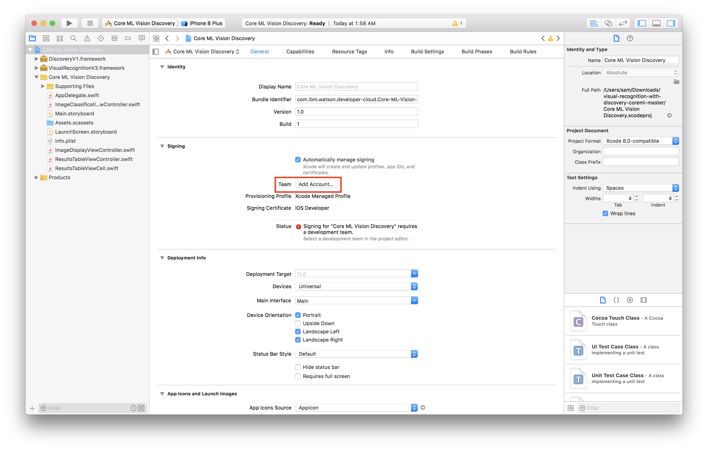

# Visual Recognition Workshop

# Lab 7 - Creating an Offline Visual Recognition application with CoreML

Watson on the IBM Cloud allows you to integrate the world’s most powerful AI into your applications and store, train and manage your data in the most secure cloud. With Watson Visual Recognition, you can quickly and accurately tag, classify and train visual content using machine learning.

This lab will introduce you to the Watson Visual Recognition capabilities for Core ML right from iPhone and iPad.

You will learn how to integrate Watson services in your Augmented Reality iOS application and how to leverage Core ML APIs to enable artificial intelligence features directly on device.

If you are not interested in Augmented Reality, you can run the code pattern available here : https://watson-developer-cloud.github.io/watson-vision-coreml-code-pattern/

## Before you begin

Make sure that you have installed [Xcode 9](https://developer.apple.com/xcode/downloads/) or later and iOS 11.0 or later. These versions are required to support Core ML.

## Getting the files

- Clone the `Watson-Visual-Recognition-CoreML-in-ARKit` mobile application locally in your working directory.

- In a terminal, run:

```
$ git clone https://github.com/fdescollonges/Watson-Visual-Recognition-CoreML-in-ARKit.git
$ cd Watson-Visual-Recognition-CoreML-in-ARKit/
```

## Getting the CoreML Model

- Go to https://dataplatform.ibm.com/data/services?target=watson&context=wdp

- Click on [watson-vision-combined-dsx](https://dataplatform.ibm.com/data/services/watson-vision-combined/crn%3Av1%3Abluemix%3Apublic%3Awatson-vision-combined%3Aus-south%3Aa%2F15d32310e6819dde886c0bb998405393%3A4139b8c2-f4f4-4b97-8d91-019263483b91%3A%3A/manage?context=wdp) 

- Click on **test** on your custom PizzaConditionModel 


- Click on **Implementation** then **Core ML** and finally on the **PizzaConditionModel_xxxxxx.mlmodel** link to download the Core ML model on your computer.
- Copy the downloaded file to `Watson-Visual-Recognition-CoreML-in-ARKit` folder

## Modify the Xcode project to our custom model

- From terminal, Open finder using : 

  ```
  $ open .
  ```

  

- Then double click the `Watson_CoreML_ARKit.xcodeproj` file to open the project in Xcode

We first need to sign the projects

- Select the project editor (*The name of the project with a blue icon*)
- Under the **Signing** section, click **Add Account** 
- Login with your Apple ID and password 
- *You should see a new personal team created*
- Close the preferences window

Now we have to create a certificate to sign our app with

- Select **General**
- Change the **bundle identifier** to `com.ibm.watson.<YOUR_LAST_NAME>.coreML-ARKit` 
- Select the personal team that was just created from the **Team** dropdown

We now need to add the export Core ML model to our project

- Open top menu **File** -> **Add Files to "Watson CoreML ARKit"**... 
- Select you CoreML model : **PizzaConditionModel_xxxxx.mlmodel** and click the **Add** button to add the core ML model to the project

We will update the code to use our custom model rather than the actual watson_tools model

- Edit "**ViewController.swift**" file
- Replace `watson_tools` with `PizzaConditionModel_xxxxx` in line 53

## Run the application

- Plug in your iOS device
- Select your device from the device menu to the right of the **build and run** icon
- Click **build and run**
- On your device, you should see the app appear as an installed appear
- When you try to run the app the first time, it will prompt you to approve the developer
- In your iOS settings navigate to **General > Device Management**
- Tap your email, tap **trust**

You can test the app.

Open pizza pictures from your favorite search engine, and check for real time classification with your custom model.

Tap on the screen to display the last classes in an augmented reality way.

You can put your phone in plane mode to see the we still get result from the local Core ML model created with Watson Visual Recognition Tooling

## Sample Output


